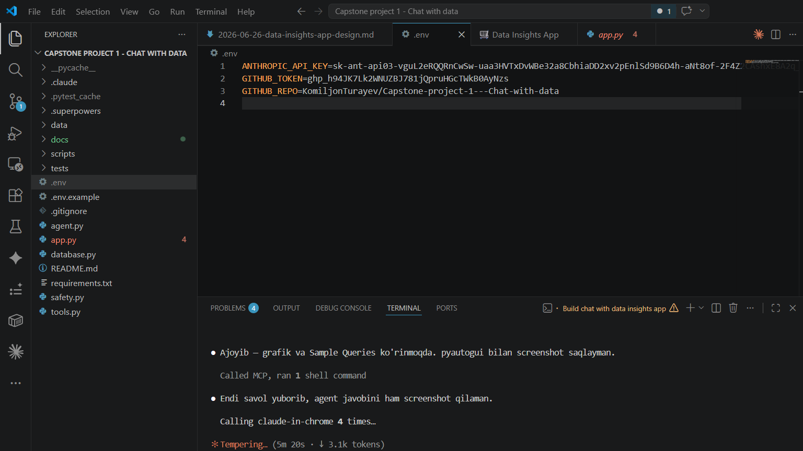

# 🎙️ Voice to Image

Convert a spoken description into an AI-generated image in three steps:
**voice → transcript → image prompt → generated image**

## Workflow

```
[Your voice]
     │
     ▼  HF Whisper Large v3
[Transcript: "a cat on a snowy mountain"]
     │
     ▼  Claude Haiku
[Image prompt: "A majestic cat perched atop snow-capped peaks, golden hour..."]
     │
     ▼  Stable Diffusion XL (HF)
[Generated image]
```

## Local Setup

### 1. Clone and install

```bash
git clone <your-repo-url>
cd voice-to-image
pip install -r requirements.txt
```

### 2. Set API keys

```bash
cp .env.example .env
# Edit .env and fill in your keys:
# ANTHROPIC_API_KEY=sk-ant-...
# HF_TOKEN=hf_...
```

Get your Anthropic key at [console.anthropic.com](https://console.anthropic.com).  
Get your HF token at [huggingface.co/settings/tokens](https://huggingface.co/settings/tokens) (read access is enough).

### 3. Run

```bash
streamlit run app.py
```

Open `http://localhost:8501` in your browser.

## Live Demo

[View on Hugging Face Spaces](<your-hf-space-url>)

## Usage

1. Open the **🎤 Record** tab and click the microphone to record your idea
2. Or open the **📁 Upload** tab and upload a WAV/MP3/M4A file
3. Click **🖼️ Generate Image**
4. View the transcript, enhanced prompt, model info, and generated image
5. Download the image with the **⬇️ Download Image** button

> **Note:** The first generation may take 30–60 seconds on HF free tier while the model warms up.

## Screenshots

### 1. App with recorded audio — ready to generate


### 2. Generated result — transcript, prompt, models, image


## Models

| Role | Model |
|---|---|
| Speech-to-Text | HF `openai/whisper-large-v3` |
| Prompt Enhancement | Anthropic `claude-haiku-4-5` |
| Image Generation | `stabilityai/stable-diffusion-xl-base-1.0` via HF Inference API |

## Project Structure

```
voice-to-image/
├── app.py          # Streamlit UI
├── pipeline.py     # Pipeline orchestrator + PipelineResult dataclass
├── steps/
│   ├── transcribe.py   # HF Whisper STT
│   ├── enhance.py      # Claude Haiku prompt enhancement
│   └── generate.py     # HF Stable Diffusion image generation
├── logger.py       # Structured console logging
└── requirements.txt
```
